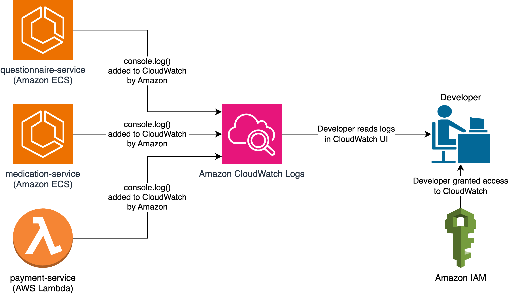
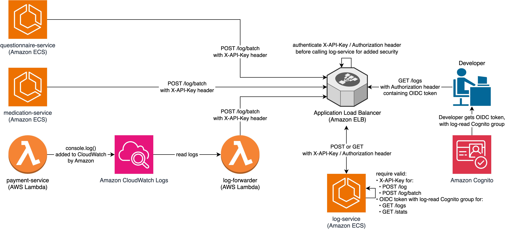

# Design Reflection Document

## Design Choices & Trade-Offs

### Express vs Fastify

| Goal            | Description                                                                                      |                                               Express                                                |                                      Fastify                                      |
| --------------- | ------------------------------------------------------------------------------------------------ | :--------------------------------------------------------------------------------------------------: | :-------------------------------------------------------------------------------: |
| **Validation**  | Validate data in requests to improve security.                                                   | [✅ yes](https://github.com/evanshortiss/express-joi-validation?tab=readme-ov-file#usage-typescript) | [✅ yes](https://fastify.dev/docs/latest/Reference/Validation-and-Serialization/) |
| **Scalability** | Respond with a stream that exceeds the server’s memory, to support `GET /logs` with TBs of logs. |        [✅ yes](https://stackoverflow.com/questions/33283989/how-do-i-stream-json-from-node)         |           [✅ yes](https://github.com/fastify/fastify/discussions/5165)           |
| **Performance** | Load logs quickly for faster development and debugging.                                          |                                           🙁 10 501 req/s                                            |                                  ✅ 45 370 req/s                                  |

### Insert Performance

[StackOverflow](https://stackoverflow.com/a/1712873) recommends running batch inserts in a transaction with SQLite.

| Inserts in Transaction | Time to Insert & Read 1 000 000 Logs |
| :--------------------: | :----------------------------------: |
|         ✅ yes         |          ✅ 38.781 seconds           |
|         ❌ no          |          ❌ 343.937 seconds          |

## Production Deployment on AWS

### Option 1: Managed Services (Allen’s Favorite)

Amazon has a managed service called [Amazon CloudWatch Logs](https://docs.aws.amazon.com/AmazonCloudWatch/latest/logs/WhatIsCloudWatchLogs.html), which:

- Automatically receives logs from Amazon ECS and AWS Lambda services.
- Automatically deletes logs after a defined number of days, which is important for GDPR.
- Has a [rich query language](https://docs.aws.amazon.com/AmazonCloudWatch/latest/logs/CWL_QuerySyntax-examples.html) for searching logs.
- Is a bit expensive.

### Option 2: `log-service`

This shows how I usually implement user authentication and Role-Based Access Control (RBAC) in services:

In many cases, [Microsoft Entra ID](https://www.microsoft.com/en-us/security/business/identity-access/microsoft-entra-id) is a better choice than Amazon Cognito.

## Audit Logs

In every API endpoint, log the:

- `timestamp`
- API endpoint
- `practitioner_id`
  - New field filled in whenever a non-patient uses an API.
